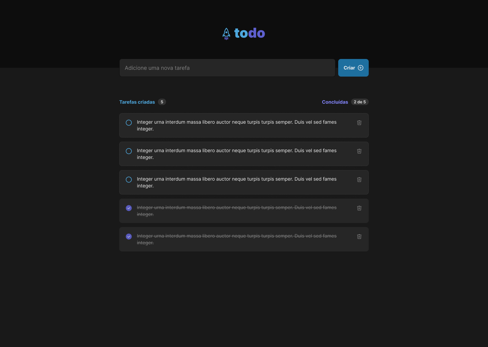

# Frontend-Todo-list
Project carried out as a challenge proposed in Rocketseat's Ignite training

## Application layout


[Desafio Ignite - Figma](https://www.figma.com/file/0n0zDN7zbzhRbaEO74Xesx/ToDo-List/duplicate)

## Application features
- Adicionar uma nova tarefa
- Marcar e desmarcar uma tarefa como concluída
- Remover uma tarefa da listagem
- Mostrar o progresso de conclusão das tarefas

## Project Setup
1. Install Nodejs
2. Install all dependencies using npm:
    ```shell
    npm install
    ```

3. Run development script:
    ```shell
      npm run dev
    ```

## Project dependencies
- **Typescript**: Improve code usage through adding strong typing to Javascript
- **Vite**: Frontend tooling (Scaffold, automation, ...)
- **React**: Frontend library
- **UUID**: For the creation of RFC4122 UUIDs


